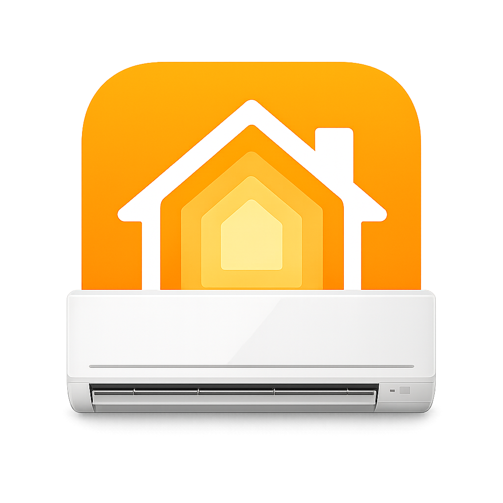

<h1 align="center">Homebridge Mitsubishi AC AU/NZ</h1>

<p align="center">
  <a href="https://www.npmjs.com/package/homebridge-mitsubishi-ac-au-nz"></a>
  <a href="LICENSE"></a>
  <a href="package.json"></a>
  <a href="https://homebridge.io/"></a>
  <a href="#features"></a>
  <a href="docs/setup.md#network-notes"></a>
</p>

<p align="center">
  
</p>

Bring your Mitsubishi Electric **Wi-Fi Control** air conditioners and heat pumps into Apple Home — and Google Home, Alexa, and SmartThings. Each unit is published as a **native Matter air conditioner** via Homebridge 2.0's Matter support, with heat, cool, auto, fan speed, optional dry mode, and an optional outdoor-temperature sensor.

A modernized fork of [`aurc/melview-mitsubishi-au-nz`](https://github.com/aurc/melview-mitsubishi-au-nz), rebuilt for Homebridge 2.0 and **migrated from HAP to native Matter** — see [what changed](docs/modernization.md).

This is a **personal fork** that I maintain for my own use — to keep the plugin current with Homebridge and Node, and to adjust it to work the way I want (for example, adding an outdoor-temperature tile). The original plugin still works well; this just lets me manage my own updates and additions. It's shared in case it's useful to others, but it isn't trying to replace the upstream project.

> [!IMPORTANT]
> **Matter required.** This plugin publishes over Matter, not HAP. You must enable a `matter` block on the Homebridge bridge it runs on, then pair the Matter bridge into Apple Home (or another ecosystem). Upgrading from the HAP version is a one-time **re-pair**. See the [Setup guide](docs/setup.md).

> [!NOTE]
> **Region:** Built for Mitsubishi Electric units in Australia and New Zealand that pair with the **Mitsubishi Wi-Fi Control** app (MELView). If your unit shows up in that app, it's a good candidate.

## Why this fork?
The original [`aurc/melview-mitsubishi-au-nz`](https://github.com/aurc/melview-mitsubishi-au-nz) pioneered MELView control but left gaps this fork closes:

- **Native Matter** — one real `RoomAirConditioner`, usable across Apple Home, Google, Alexa, and SmartThings (the original was Apple-only HAP).
- **Capability-matched fan speed** — Matter FanControl with the slider's steps matched to each unit's *real* fan stages, plus auto fan where supported.
- **It feels instant** — state snaps to the new value the moment you send a command, instead of lagging until the next poll.
- **Built for current Homebridge** — Homebridge 2.0 and Node 22/24.
- **Harder to break** — discovery won't drop your accessories on a flaky MELView response, polling is gentle on the API, and re-authentication is handled cleanly.

Full breakdown: [what changed vs the original](docs/modernization.md).

## Features
- **Native Matter Air Conditioner** — Apple Home renders it as an AC/thermostat tile.
- **Power** and **mode** (heat / cool / auto), matched to each unit's real capabilities.
- **Fan speed** via the Matter FanControl cluster, with auto fan where supported.
- **Target & room temperature** within each unit's supported range.
- **Outdoor temperature** *(optional)* — as a separate Matter temperature-sensor tile.
- **Dry mode** *(optional)* — maps to Matter `SystemMode.Dry` (best-effort).
- **Multi-ecosystem** — share the same accessory with Google Home, Alexa, and SmartThings.

Native Matter device types only — no custom characteristics, no "pretend" fan accessory.

> [!NOTE]
> **Swing is not exposed.** Homebridge's Matter FanControl wrapper has no swing (`rockSetting`) control handler, so swing was dropped in the move to Matter. See [Known limitations](docs/setup.md#known-limitations).

## Quick start
1. Install [Homebridge](https://homebridge.io/) `2.0+` on Node `22`/`24`, and **enable Matter** on the bridge (a `matter` block in the bridge config).
2. In the Homebridge Config UI, install **`homebridge-mitsubishi-ac-au-nz`** and enter your MELView credentials.
3. Restart Homebridge, then **pair the Matter bridge** into Apple Home using the code shown in the Homebridge UI.

Minimal `config.json`:

```json
{
  "platform": "MitsubishiAUNZ",
  "user": "user@example.com",
  "password": "your-password"
}
```

➡️ **Enabling Matter, all config options, pairing, migration, and troubleshooting: [Setup guide](docs/setup.md).**

## Documentation
- **[Setup guide](docs/setup.md)** — requirements, enabling Matter, installation, config options, migrating from HAP, network notes, troubleshooting, and local development.
- **[What changed vs the original](docs/modernization.md)** — how this fork differs from `aurc/melview-mitsubishi-au-nz`, and the HAP→Matter move.
- **[Energy reporting notes](docs/energy-reporting.md)** — why energy isn't exposed yet and what would unblock it.
- **[Changelog](CHANGELOG.md)** — what changed in each release.

## Roadmap
- **Energy reporting** — the natural next step now that we're on Matter: iOS 27's native Apple Home **Energy** tab reads the Matter Electrical Power/Energy Measurement clusters. Still blocked on (1) Homebridge's Matter API exposing those clusters to plugins, and (2) confirming MELView's energy data source. Units advertising energy support are logged in the meantime. Tracked in [docs/energy-reporting.md](docs/energy-reporting.md).

## Credits & license
Builds on [`aurc/melview-mitsubishi-au-nz`](https://github.com/aurc/melview-mitsubishi-au-nz) and the MELView reverse-engineering notes from [`NovaGL/diy-melview`](https://github.com/NovaGL/diy-melview). Licensed under [Apache-2.0](LICENSE).
